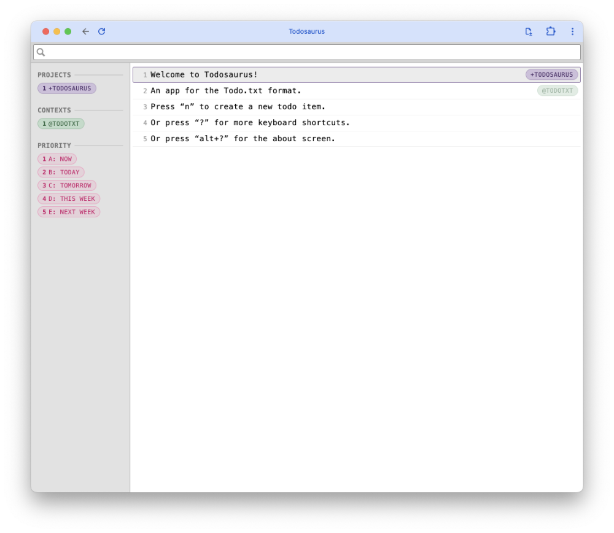

# Todosaurus

A keyboard driven GUI app for the [Todo.txt](http://todotxt.com/) format.

---

### [⬇ Download (for Mac OS X)](https://github.com/thomasjbradley/todosaurus/releases/download/v1.0.4/Todosaurus-v1.0.4.zip)

---

## Why?

I’ve struggled to find a todo app that worked for me. Many are too complicated. Many are too closed. Many aren’t keyboard driven enough. Many don’t match my design sensibilities.

So, I recently really went digging to find something that I would enjoy using. The closest I found was the Todo.txt format used in the command line. But for me the command line doesn’t provide the right context in my brain for handling my todo list. I tried a couple of the Todo.txt GUI apps listed on the website, but their key bindings weren’t intuitive to me.

So, I made my own.

---

## Keyboard shortcuts

### Movement

- `j`, `down` — Move the focus down
- `k`, `up` — Move the focus up
- `g g`, `command+up` — Move focus to the first item
- `G`, `command+down` — Move focus to the last item
- `ctrl+d`, `pagedown` — Move focus down 5 items
- `ctrl+u`, `pageup` — Move focus up 5 items
- `command+j` — Jump to a specific line

### Editing

- `n`, `command+n` — New todo at the top
- `shift+n`, `command+shift+n` — New todo at the bottom
- `o`, `command+enter` — New todo after the focused item
- `O`, `command+shift+enter` — New todo before the focused item
- `x`, `space` — Mark/unmark todo as complete
- `1`, `2`, … `5` — Add priority to todo
- `0` — Remove priority
- `e`, `enter`, `return` — Update an item, selecting all the text
- `i`, `shift+i` — Edit the focused item, cursor at the start
- `a`, `shift+a` — Edit the focused item, cursor at the end
- `shift+c` — Edit the focused item, delete all current content
- `d d`, `command+backspace`, `del`, `command+x` — Delete todo, move to buffer, copy to clipboard
- `shift+y`, `command+c` — Copy todo item to buffer and clipboard
- `p`, `command+v` — Paste top buffer item below the focused item
- `shift+p`, `command+shift+v` — Paste top buffer item above the focused item
- `y p`, `command+shift+d` — Duplicate line, add afterwards
- `d d k shift+p`, `command+shift+up` — Move item up
- `d d p`, `command+shift+up` — Move item down

### Manipulating the view

- `/`, `command+f` — Search todo items
- `command+l`, `ctrl+l` — Clear search terms
- `command+p` — Filter by project
- `command+t` — Filter by context
- `command+1`, `command+2`, … `command+9` — Display single project
- `alt+1`, `alt+2`, … `alt+9` — Display single context
- `shift+1`, `shift+2`, … `shift+5` — Display single priority
- `command+0`, `alt+0`, `shift+0` — Clear tag filter
- `command+shift+l`, `ctrl+shift+l` — Clear all filters

### Manipulating the file

- `command+r` — Reload the file
- `command+shift+s` — Sort the contents of the file
- `command+s` — Archive all the completed items into `done.txt`
- `command+shift+r` — Reveal the directory in the Finder
- `command+o` — Switch to another directory

---

## Development

Follow development on Trello: <https://trello.com/b/l1cs0nyA>.

### Technology

Built using web technologies and [node-webkit](https://github.com/rogerwang/node-webkit/).
Also works perfectly in the browser, storing the todos in LocalStorage.

---

## Licenses & copyright

**© 2014 Thomas J Bradley. Licensed under the [GPL](LICENSE).**

Uses the [Todo.txt](http://todotxt.com/) format, © 2006-2014 Gina Trapani, licensed under the [GPL](http://www.gnu.org/copyleft/gpl.html).

[“Dinosaur”](http://thenounproject.com/term/dinosaur/13786/), © 2013 Jennifer Cozzette, licensed under the [CC BY 3.0](http://creativecommons.org/licenses/by/3.0/us/).

Prioritization system inspired by Michael Descy’s [Plain Text Productivity](http://plaintext-productivity.net/1-03-how-i-organize-my-todo-txt-file.html).
